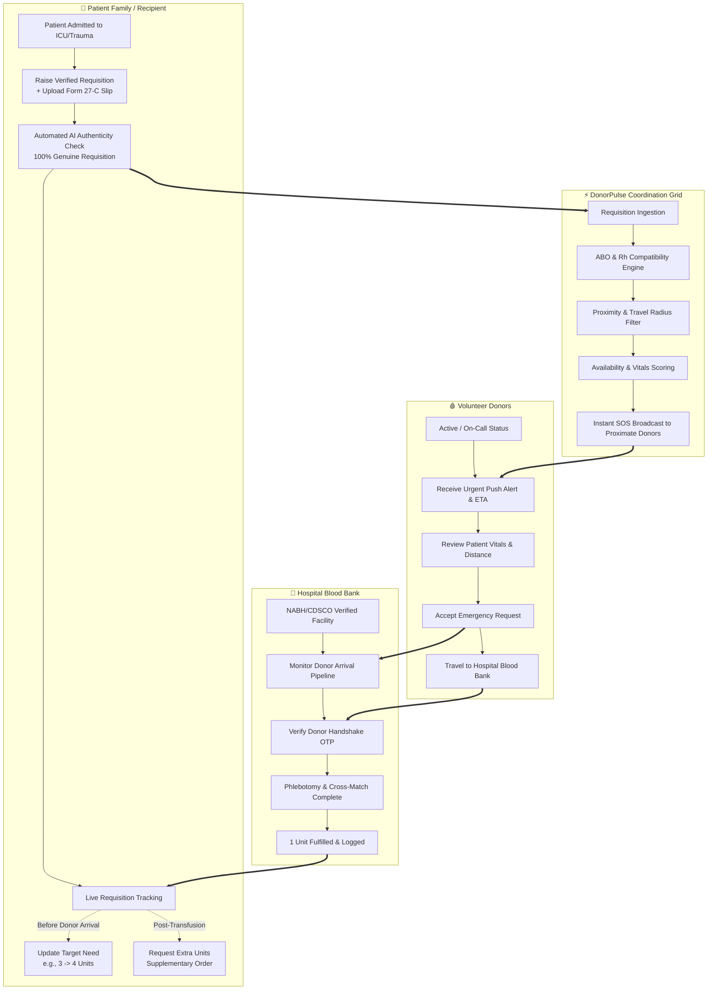

# 🩸 DonorPulse — National Real-Time Haemovigilance & Blood Donation Grid

<div align="center">


### **Connect. Donate. Save Lives. When Every Second Matters.**

[](https://opensource.org/licenses/ISC)
[](#)
[](#)
[](#)
[-orange.svg)](#)

*An autonomous digital haemovigilance coordination platform bridging verified trauma centers, volunteer blood donors, and anxious patient families in real time.*

[Live Demo](#-quick-start--running-locally) • [Key Features](#-key-features) • [Three-Role Ecosystem](#-three-role-ecosystem) • [Compatibility Engine](#-haemovigilance--compatibility-matrix) • [Architecture](#-technical-architecture)

</div>

---

## 📌 Executive Summary & Problem Statement

In severe medical emergencies—such as multi-vehicle trauma accidents, complex cardiovascular surgeries, acute postpartum hemorrhage, or oncological platelet refractory crises—**the availability of compatible blood within the "Golden Hour" determines survival.**

### The Critical Coordination Gap
Traditional blood banks maintain inventories, but severe bottlenecks frequently occur:
1. **Inventory Gaps for Rare & Perishable Components**: Platelets (Apheresis) have a short 5-day shelf life, and rare blood types ($O^-$, $AB^-$, Bombay phenotype) are perpetually scarce.
2. **Slow, Fragmented Communication**: Relatives often resort to frantic phone calls, forwarded WhatsApp messages, and unverified social media posts that waste precious minutes.
3. **Lack of Recipient Workflow Control**: Patient attendants frequently struggle to update requisition amounts as clinical conditions evolve in the ICU without restarting bureaucratic paperwork.
4. **No Real-Time Telemetry**: Hospitals and families have no visibility into whether a volunteer donor has accepted, is currently en route, or has arrived at the phlebotomy lab.

### The DonorPulse Solution
**DonorPulse is not a replacement for blood banks—it is an autonomous digital coordination grid that complements existing healthcare infrastructure.** It connects **Hospitals**, **Pre-Screened Donors**, and **Patient Families/Recipients** through a unified, real-time reactive platform featuring automated blood compatibility verification, live proximity matching, clinical requisition adjustment, and secure handshake verification.

---

## 🔄 How DonorPulse Works



---

## 👥 Three-Role Ecosystem

DonorPulse features dedicated, tailor-made user interfaces for each participant in the blood donation lifecycle:

### 1. 🩸 Individual Donor Portal (`donor-dashboard.html`)
Empowers community volunteers with tools to monitor their biological eligibility, receive urgent nearby alerts, and track their life-saving impact:
- **On-Call Availability Toggle**: Instant one-click switch between `Active / On Call` and `Temporarily Unavailable`.
- **Comprehensive Health Vitals**: Live metrics tracking Hemoglobin levels ($14.8\text{ g/dL}$), Blood Pressure ($118/76\text{ mmHg}$), Pulse ($72\text{ bpm}$), and Weight ($64\text{ kg}$).
- **Biological Recovery Tracker**: Accurate countdowns to next donation eligibility date based on component type (Whole Blood vs. Apheresis Platelets).
- **Proximity-Based Emergency Alerts**: Real-time triage cards showing patient condition, distance ($1.4\text{ km}$ Indiranagar), urgency, and hospital location.
- **Acceptance & Arrival Flow**: One-click dispatch with estimated time of arrival (ETA) generation.
- **Secure 4-Digit Handshake OTP**: Cryptographic check-in code (`7842`) verified by the hospital blood desk prior to phlebotomy.
- **Gamified Milestones & Rewards**: Bronze, Silver, Gold, and Platinum tier progression, reward points, and a lives-saved counter ($24\text{ lives saved}$).
- **Digital Verified Donation Certificate**: Official downloadable certification with hospital seal, doctor registration number, and cryptographic serial ID.

### 2. 🏥 Hospital & Trauma Center Portal (`hospital-dashboard.html`)
Equips clinical superintendents and blood bank officers with institutional triage and dispatch controls:
- **Statutory Accreditation Verification**: NABH Blood Bank Operating License & CDSCO Clearance Form 28-C verification lifecycle (`Verified`, `Pending`, or `Rejected` with administrative reasoning).
- **Emergency Requisition Builder**: Create clinical requests specifying patient age, blood component (Apheresis Platelets, Whole Blood, PRBC, FFP), units required, trauma level, ward/bed, and attending surgeon details.
- **Proximate Donor Discovery Grid**: Live matching pool ranking local donors by compatibility score, distance, contact info, and response status.
- **Handshake Verification Console**: Securely enters and validates donor OTP codes at check-in to prevent misidentification.
- **Multi-Stage Real-Time Pipeline**: Visual tracking through all 6 clinical stages from broadcast to transfusion completion.

### 3. 🛡️ Recipient & Patient Attendant Portal (`recipient-dashboard.html`)
Designed specifically for anxious patient families and attendants to maintain full control of patient requisitions:
- **Verified Patient Requisition Creator**: Allows relatives to raise official blood requests by attaching hospital admission proof.
- **AI-Powered Document Verification Simulator**: Analyzes uploaded Form 27-C slips, verifies doctor registration (NMC/KMC), detects official hospital seals, and outputs a 100% Genuine Requisition score.
- **Medical Proof Viewer**: Modal inspector to inspect signed medical requisition slips, review IPD case numbers, and print verified requisitions.
- **⚡ Update Need (Before Donor Arrival)**:
  - Specially designed for clinical scenarios where the attending doctor revises the unit requirement *while donors are already en route*.
  - **No Duplicate Data Entry**: Preserves all patient, hospital, and attendant details.
  - Interactive stepper with quick-select presets ($2, 3, 4, 5\text{ units}$) and dynamic requirement calculation banners.
- **🔄 Request Extra Blood Units (Post-Receipt Order)**:
  - Designed for cases where initial units were successfully transfused but additional units are urgently required post-infusion (e.g., sub-optimal platelet counts).
  - Automatically acknowledges previously fulfilled units ($1\text{ Unit Fulfilled}$) and orders supplementary units with required clinical justification without restarting the process.
- **1-Click WhatsApp & SMS Appeal Generator**: Formats and copies verified emergency appeal cards for instant community distribution.

---

## 🧬 Haemovigilance & Compatibility Matrix

DonorPulse incorporates an automated clinical compatibility engine adhering to standard red cell and plasma transfusion rules:

| Recipient Blood Group | Compatible Whole Blood / PRBC Donors | Compatible Platelet / Apheresis Donors | Compatible Fresh Frozen Plasma (FFP) |
| :--- | :--- | :--- | :--- |
| **O−** *(Universal RBC)* | **O−** | O−, O+ | O−, O+, A−, A+, B−, B+, AB−, AB+ |
| **O+** | O−, O+ | O−, O+ | O+, A+, B+, AB+ |
| **A−** | O−, A− | A−, A+, O−, O+ | A−, A+, AB−, AB+ |
| **A+** | O−, O+, A−, A+ | A+, A−, O+, O− | A+, AB+ |
| **B−** | O−, B− | B−, B+, O−, O+ | B−, B+, AB−, AB+ |
| **B+** | O−, O+, B−, B+ | B+, B−, O+, O− | B+, AB+ |
| **AB−** | O−, A−, B−, AB− | AB−, AB+ | **AB−, AB+** |
| **AB+** *(Universal RBC)* | **All Blood Types** | **AB+** | **AB+ Only** *(Universal Plasma Donor is AB)* |

---

## 💻 Technical Architecture

```
donor-pulse/
├── index.html                  # Core Single Page Application (SPA) with Hash Router
├── homepage.html               # Public Marketing & Information Landing Page
├── role-selection.html         # Portal Selection Gateway (Donor vs. Recipient vs. Hospital)
├── donor-dashboard.html        # Standalone Individual Donor Workspace
├── recipient-dashboard.html    # Standalone Patient Attendant & Requisition Workspace
├── hospital-dashboard.html     # Standalone Hospital Clinical Triage & Phlebotomy Workspace
├── hospital-register.html      # Hospital Onboarding & Accreditation Upload Form
├── server.js                   # Lightweight Zero-Dependency Node.js Server
├── server.py                   # Alternate Python HTTP Server (Cross-Platform)
├── run.bat                     # Windows 1-Click Launch Script
├── vercel.json                 # Vercel Deployment Configuration
├── css/
│   ├── style.css               # Tailwind CSS Base & Theme Design Tokens
│   └── custom.css              # Custom Animations, Glassmorphism, & Print Styles
├── js/
│   ├── app.js                  # Master Application Controller & UI Event Handlers
│   ├── store.js                # Central Reactive PulseStore (LocalStorage Engine)
│   ├── router.js               # Client-Side Hash Router (#/donor, #/recipient, etc.)
│   └── blood-cells.js          # Interactive HTML5 Canvas Floating Blood Cell Particle System
└── images/                     # Logos, Favicons, and Verification Badges
```

### Key Technologies
- **Frontend Core**: Semantic HTML5, Vanilla ES6+ JavaScript, Tailwind CSS 3.
- **Design Tokens**: Google Fonts (*Plus Jakarta Sans*, *Inter*), Google Material Symbols, Material Design 3 surface elevations, and adaptive Dark/Light theme variables.
- **State Management (`PulseStore`)**:
  - Reactive central store implemented in `js/store.js`.
  - Backed by persistent browser storage key `donorpulse_state_in_v3`.
  - Supports live cross-role simulation (actions taken in Hospital or Recipient dashboard instantly reflect across Donor and Tracking views).
- **Audio Synthesizer Engine**:
  - Web Audio API integration for authentic acoustic feedback on emergency dispatches and check-in completions without external audio files.
- **Interactive Canvas Engine (`js/blood-cells.js`)**:
  - Dynamic fluid simulation of floating erythrocytes, leukocytes, and platelets on landing pages.

---

## 🚀 Quick Start & Running Locally

### Prerequisites
- Either **Node.js** (v14+) **OR** **Python** (v3.7+) installed on your machine.
- A modern web browser (Chrome, Edge, Firefox, Safari).

### Option 1: Running with Node.js (Recommended)

1. **Clone the repository:**
   ```bash
   git clone https://github.com/shrashti5may-stack/Donor_Pulse.git
   cd Donor_Pulse
   ```

2. **Start the local server:**
   ```bash
   npm start
   ```
   *(Or run directly: `node server.js`)*

3. **Open in your browser:**
   ```
   http://localhost:3000
   ```

---

### Option 2: Running with Python

```bash
# From within the DonorPulse directory:
python server.py
```
Open `http://localhost:3000` in your browser.

---

### Option 3: Windows 1-Click Script

Double-click `run.bat` in the project root. It will detect your installed environment, start the server, and automatically launch your default browser.

---

## 🧪 Interactive Walkthrough & Testing Guide

To experience the full multi-role reactive workflow:

1. **Visit the Home Page**: Open `http://localhost:3000/index.html`.
2. **Access Role Selection**: Click **"GET STARTED"** to navigate to `role-selection.html`.
3. **Explore the Recipient Dashboard**:
   - Choose **"Recipient / Family Login & Dashboard"**.
   - Review patient **Devika Sharma** (`#REQ-9042`, $B^+$ Platelets at Apollo Hospitals).
   - Click **"Update Need"**: Notice how you can change units from $3 \rightarrow 4$ units before donor arrives without re-entering basic info.
   - Click **"Request More Blood"**: Experience the post-receipt workflow ordering supplementary units when $1\text{ unit}$ has already been fulfilled.
   - Click **"View Medical Proof"**: Inspect the simulated authenticated Form 27-C signed requisition slip.
4. **Switch to Donor Dashboard**:
   - Navigate to `index.html#/donor-dashboard` or open `donor-dashboard.html`.
   - Toggle the **"Availability"** switch to see live status updates.
   - View the incoming emergency alert for Apollo Hospitals and click **"Accept Request"**.
   - Note the **4-digit Handshake OTP** (`7842`).
5. **Switch to Hospital Dashboard**:
   - Open `hospital-dashboard.html` or navigate to `index.html#/hospital-dashboard`.
   - Inspect the incoming donor list, verify accreditation status, and confirm donor check-in.

---

## 🛡️ Security, Privacy & Statutory Compliance

DonorPulse is architected around healthcare compliance standards:
- **Statutory Form 27-C Alignment**: Adheres to Drugs and Cosmetics Act requirements for hospital blood requisition and physician authorization.
- **NABH & CDSCO Standardized Profiles**: Enforces hospital accreditation license tracking (Form 28-C).
- **Privacy & Patient Confidentiality**: Attendant phone numbers and patient identifiers are scoped strictly to verified emergency participants.
- **Cryptographic Handshake**: Requires bidirectional OTP verification before phlebotomy to prevent donor impersonation and delivery errors.

---

## 🔮 Future Roadmap

- [ ] **e-RaktKosh API Integration**: Bi-directional synchronization with national blood bank inventories.
- [ ] **WebSocket Real-Time Gateway**: Live multi-device push notifications and driver telemetry.
- [ ] **Mobile Native Apps**: React Native / Flutter apps for iOS & Android with background geofencing.
- [ ] **Aadhaar / ABHA Health ID Linking**: One-click donor onboarding via Ayushman Bharat Digital Mission (ABDM).
- [ ] **Automated SMS & IVR Fallback**: High-priority automated telephonic dispatch for non-smartphone donors in rural clinical districts.

---

## 📄 License & Attribution

This project is licensed under the **ISC License**. Developed as a modern digital health initiative to accelerate life-saving blood mobilization.

<div align="center">
  <sub>Built with ❤️ for patients, donors, and healthcare heroes everywhere.</sub>
</div>